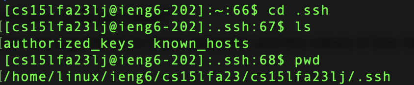
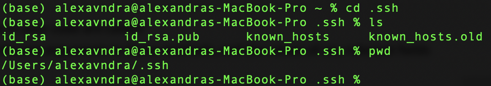
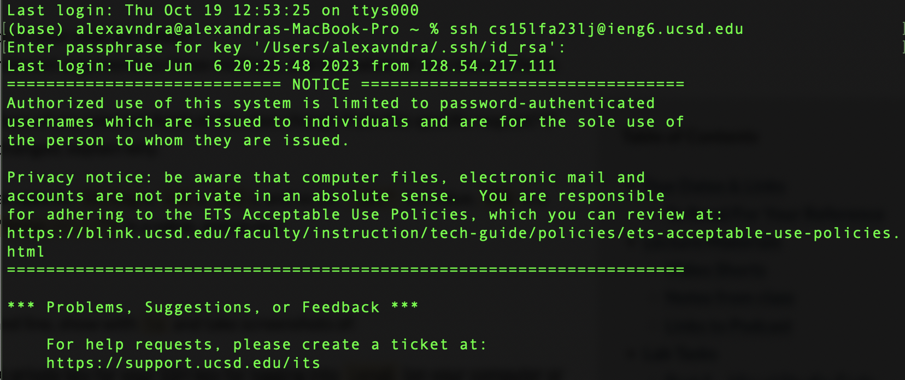

# Lab report 2
1. <a href="https://alexavndra.github.io/cse15l-lab-reports/lab2#part-1" style="color:#023e8a;">Part 1</a>
2. <a href="https://alexavndra.github.io/cse15l-lab-reports/lab2#part-2" style="color:#023e8a;">Part 2</a>
3. <a href="https://alexavndra.github.io/cse15l-lab-reports/lab2#part-3" style="color:#023e8a;">Part 3</a>

## Part 1
This is my code for `StringServer.java`. 
In this screenshot, the code method used are `handleRequest`, which takes a parameter called `URI url`, which is what handles the query requests put into the URL. From there, it determines whether the given query is in the command list provided (either `/` or `/add-message`). If it just the `/`, then it will return the current query list; if the given command is `add-message`, it will examine the query provided after (e.g. the query is "Hello"), and then add it to the query list. After adding it to the query list, it will display the updated list on the screen. If incorrect values (e.g. an unknown query command, a new URI outside of the `localhost`), are provided, it will print a "404" error to the user.

### First output
 
In this screenshot, the we called the `add-message` method, which takes the given arguments (in this case, the message) and adds it into the query; from there, the query is displayed on the web page. In order to initiate the query, the relevant arguments includes the `add-message` in our URL, signifying that we want to call the method within the code, any string/words given after the "=" separator in the URL (in this case, our argument is "hello"). The given string also falls under the relevant fields of our string query. Calling back to `add-message` within the URL, the values change in that the query is added to with the given message arguments. 

### Second Output

Similarly to the first screenshot, in this second picture, the primary method called is `add-message`, which takes the given query and adds it to the generated query list; after adding it, it displays the updated list on the web page. Since we already initialized/added a word into the query, the new "How are you" in the query is shown to be second in the list, with "Hello" topping the query list. The relevant arguments, like previously mentioned, include the `add-message` in our URL, signifying that we want to call the method within the code, any string/words given after the "=" separator in the URL (we now add "How are you"). The given string also falls under the relevant fields of our string query. The values of the query and its list constantly change as you add more and modify what's in the list. However, if we do not provide any new arguments, and assuming the query list is already initialized and populated, the values will remain the same. 

## Part 2
This is me going into the `.ssh` folder on my CSE15L profile. 

Now this is me going into the `.ssh` folder on my own computer (not logged onto the `ieng6` server). 

Lastly, I logged into the `ieng6` server using the passphrase I created; though I can't put the passphrase nor the whole output, it successfully logged me in. 

## Part 3
Something I learned in Week 3's lab was successfully inputting SSH public keys into my profile. Though I've worked several times with SSH keys and tokens prior to CSE 15L, I didn't use them other than "completion" purposes (e.g. work to get into GitLab). But learning that I can `scp` my computer's SSH keys into a remote profile actually shorthands how I log into my job's remote server. I find this extremely helpful, as my password is extremely long; with using the short passphrase I created, it saves me so much time–and slow key typing–in logging in.