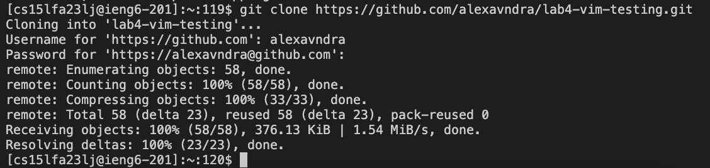

# Lab report 4
1. <a href="https://alexavndra.github.io/cse15l-lab-reports/lab4#step-4" style="color:#023e8a;">Step 4</a>
2. <a href="https://alexavndra.github.io/cse15l-lab-reports/lab4#step-5" style="color:#023e8a;">Step 5</a>
3. <a href="https://alexavndra.github.io/cse15l-lab-reports/lab4#step-6" style="color:#023e8a;">Step 6</a>
4. <a href="https://alexavndra.github.io/cse15l-lab-reports/lab4#step-7" style="color:#023e8a;">Step 7</a>
5. <a href="https://alexavndra.github.io/cse15l-lab-reports/lab4#step-8" style="color:#023e8a;">Step 8</a>
6. <a href="https://alexavndra.github.io/cse15l-lab-reports/lab4#step-9" style="color:#023e8a;">Step 9</a>

## Step 4

**Keys pressed**: `ssh cs15lfa23lj@ieng6.ucsd.edu` <enter\> and my keyphrase <enter\>

## Step 5

**Keys pressed**: `git clone` <cmd + v\><enter\> the repo URL, and then entered my username `alexavndra` and GitHub token when prompted.

## Step 6

**Keys pressed**: <up\><up\><up\><up\><up\><enter\> to get into the now cloned repository. Then <cmd + v\>, <cmd + v\> `List` <tab\> `T` <tab\><enter\>. The command of `cd lab4-vim-testing/` was 5 up in my history, and I had `javac -cp .:lib/hamcrest-core-1.3.jar:lib/junit-4.13.2.jar *.java` and `java -cp .:lib/hamcrest-core-1.3.jar:lib/junit-4.13.2.jar org.junit.runner.JUnitCore` in my clipboard; to get the `ListExamplesTest` I typed out the first few words, tabbing the rest. 

## Step 7

**Keys pressed**: `vim L` <tab\> `.` <tab\><enter\> to get into the `vim` editor. Then <cmd + v\><n\><n\><n\><n\><n\><n\><n\><n\><n\><y\> to change the confirmed line by searching all lines and asking permission to change it to `index2`. The command `:%s/\<index1\>/index2/gc` was already on the clipboard prior to. `:wq` <enter\> to save and quit.

## Step 8

**Keys pressed**: <up\><up\><up\><up\><up\><up\><up\><enter\>, <up\><up\><up\><enter\>; the `javac -cp .:lib/hamcrest-core-1.3.jar:lib/junit-4.13.2.jar *.java` was up 7 in my bash history (had to recompile after the change), and the `java -cp .:lib/hamcrest-core-1.3.jar:lib/junit-4.13.2.jar org.junit.runner.JUnitCore ListExamplesTests` was up 3 as well. 

## Step 9

**Keys pressed**: `git a` <tab\><tab\> `d` <tab\> `Li` <tab\><enter\>, `git com` <tab\> `-m "Updated"` <enter\>, <cmd + v\> `alexavndrarh@gmail.com` <enter\>, `git pu` <tab\> `s` <tab\><enter\>, `alexavndra`, <cmd + v\><enter\>; the `git add` I used <tab\> to get the command, as well as the `ListExamples` file. I then used <tab\> to get the `git commit` command, and then put the message. I also changed the email to commit from by pasting the command `git config --global user.email` and editing the email given, and then lastly typed my user and pasted my token to fully commit to the remote repository.
