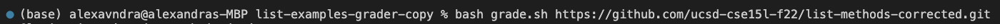

# Lab report 5
1. <a href="https://alexavndra.github.io/cse15l-lab-reports/lab5#debugging-scenario" style="color:#023e8a;">Debugging Scenario</a>
2. <a href="https://alexavndra.github.io/cse15l-lab-reports/lab5#reflection" style="color:#023e8a;">Reflection</a>

## Debugging Scenario
<span style="color:#1279b0"> **Anonymous** </span><br/>
Hello! I'm working on this `grade.sh` bash script to help evaluate whether the given git repo is correct or not, and when testing a "correct" GitHub repo, it still returns that the repo is a "failure," rather than a pass. I know that the "correct" GitHub repo is what is causing the error (as a "flawed" repo gives the right output of failing), yet I'm not sure what *exactly* in the bash script is making it still fail, but I think it's in the compilation of the "correct" repo, judging by the `java.lang.IllegalArgumentException` error.


<span style="color:#12b061"> **TA** </span><br/>
Hi, looking at the screenshot attached to your post, you are correct in that there's a compilation error in your bash script, making the grader "automatically" fail (despite not running the Java grader). Assuming that the error is around wherever you started compiling the code, I would suggest looking at the different directories in your code, and possibly using `cd` to adjust where you will be compiling the code.

<span style="color:#1279b0"> **Anonymous** </span><br/>
I tried using the `cd` command you suggested to help redirect the compilation, and it looks like the bash script can now run the Java test file for the "correct" GitHub repo code! Looking at what I changed in the code, the bug was where the code compiled, which was in the `list-example-grader` directory, rather than the `grading-area` subdirectory; though all the necessary files (the repo, Java test file, and JUnit files) were moved correctly–and existed–in the `grading-area` subdirectory, they could not be ran because the `javac` compiler was still running *outside* the subdirectory. As a result, when the bash script attempted to run the tests in the `grading-area` subdirectory, it found that the `.class` file of the `TestListExamples.java` did not exist. 


### Setup information
#### File structure
```
.
├── GradeServer.java
├── Server.java
├── TestListExamples.java
├── grade.sh
├── grading-area
│   ├── IsMoon.class
│   ├── ListExamples.class
│   ├── ListExamples.java
│   ├── StringChecker.class
│   ├── TestListExamples.class
│   ├── TestListExamples.java
│   └── lib
│       ├── hamcrest-core-1.3.jar
│       └── junit-4.13.2.jar
├── junit-output.txt
├── lib
│   ├── hamcrest-core-1.3.jar
│   └── junit-4.13.2.jar
├── student-submission
│   └── ListExamples.java
└── test.txt

5 directories, 17 files
```

#### Contents of file *pre* bug fix


#### Command line input to trigger the bug


#### How to fix the bug
1. Turn off the bash error environment before running the compilation with `set +e`.
2. Run `cd grading-area` to redirect the bash script to run in the `grading-area` subdirectory.
3. Compile the code with `javac -cp .:lib/hamcrest-core-1.3.jar:lib/junit-4.13.2.jar *.java` to make sure that there are `.class` files for all the `.java` files present in the `grading-area` subdirectory.
4. Run the Java test file with `javac -cp .:lib/hamcrest-core-1.3.jar:lib/junit-4.13.2.jar org.junit.runner.JUnitCore TestListExamples`.
5. Make sure that any failure output goes into a `.txt` file by redirecting any failures with `> ../junit-output.txt` at the end of the previous command.
6. Return to the main directory with `cd ../` to ensure that there is/is not a `junit-output.txt` file.

## Reflection
Few things I've learned from the CSE 15L labs were creating more bash scripts and how to debug outside of an IDE (e.g. Visual Studio). Though I worked with bash scripts before (I work with them for my job), most of the bash scripts I do/work with there is more so modifying and running existing scripts, rather than creating them from scratch. In the labs, creating the grading lab scripts allowed me to utilize bash commands into a script, constructing complex operations to run on a single instance (e.g. just running `bash grade.sh [repo]` to run a multilude of commands). As for the debugging without an IDE, I usually do code with the help of an IDE (Visual Studio), and I usually will debug by commenting out an entire function and uncommenting to 'pinpoint' the issue. With the Java Debugger and its techniques in `step` and `locals`, it allowed for more efficient debugging sessions, as well as more specific pinpointing of code issues. 

In a couple of sentences, describe something you learned from your lab experience in the second half of this quarter that you didn’t know before. It could be a technical topic we addressed specifically, something cool you found out on your own building on labs, something you learned from a tutor or classmate, and so on. It doesn’t have to be specifically related to a lab writeup, we just want to hear about cool things you learned!